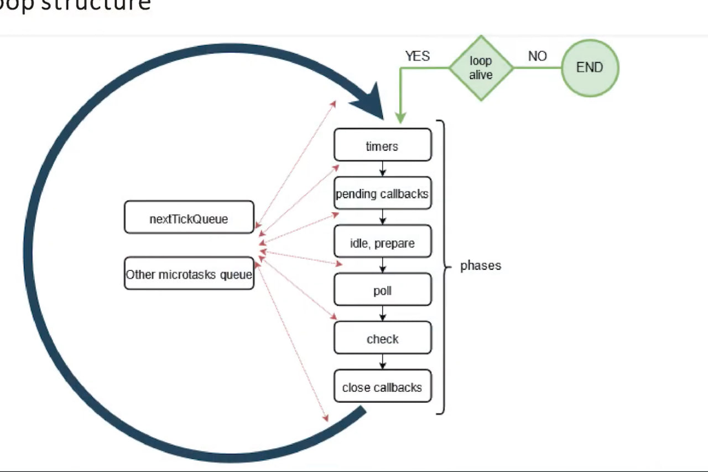

# Node js

## Resources

[Getting started with NodeJS](https://nodejs.org/en/learn/getting-started/introduction-to-nodejs)

### Table of Contents

<!-- TOC_START -->

| No. | Theme                     |
| --- | ------------------------- |
| 1   | [Event loop](#event-loop) |

<!-- TOC_END -->

<!-- QUESTIONS_START -->

1. #### Event loop

2. #### CREATE table

**[⬆ Back to Top](#table-of-contents)**
