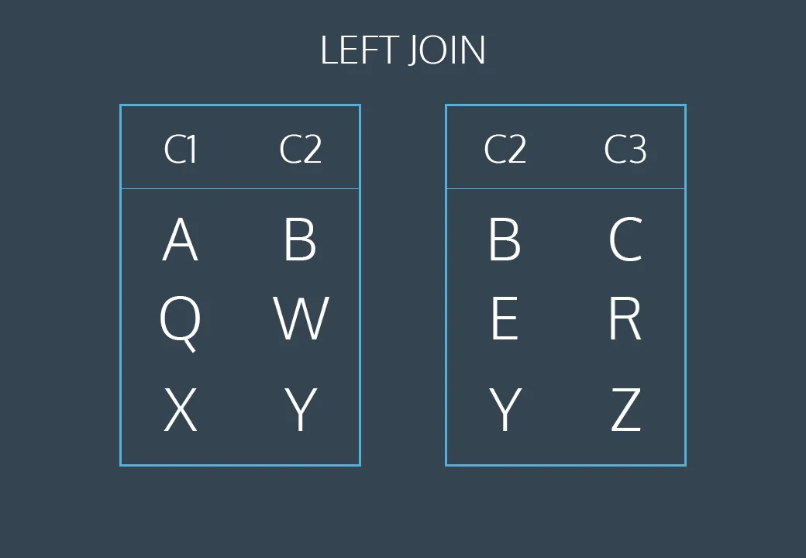

# Sql Postgres DB knowledge base

<div>
  <p align="center">
    
  </p>
</div>

## Resources

[Codeacademy Learn](https://www.codecademy.com/enrolled/courses/learn-sql)
[Yandex Learn](https://practicum.yandex.com/trainer/sql-database-basics)
[Yandex Basic Cheetsheet](./assets/basic.pdf)
[Yandex Selecting and Filtering Cheetsheet](./assets/topic_filtering.pdf)
[Yandex Aggregation Cheetsheet](./assets/topic_aggregating.pdf)

### Table of Contents

<!-- TOC_START -->

| No. | Theme                                           |
| --- | ----------------------------------------------- |
| 1   | [SELECT](#select-data-from-db)                  |
| 2   | [CREATE table](#create-table)                   |
| 3   | [INSERT data to tables](#insert-data-to-tables) |
| 4   | [ALTER TABLE](#alter-table)                     |
| 5   | [UPDATE](#update)                               |
| 6   | [IS NULL](#is-null)                             |
| 7   | [WHERE](#where)                                 |
| 8   | [Build-in Functions](#build-in-functions)       |
| 9   | [DELETE FROM](#delete-from)                     |
| 10  | [Regex](#regex)                                 |
| 11  | [CASE](#case)                                   |
| 12  | [Aggregate functions](#aggregate-functions)     |
| 13  | [GROUP BY](#group-by)                           |
| 14  | [ORDER BY](#order-by)                           |
| 15  | [JOIN ON](#join-on)                             |
| 16  | [UNION](#union)                                 |
| 17  | [WITH](#with)                                   |
| 18  | [Dates](#dates)                                 |
| 19  | [Subquery](#subquery)                           |

<!-- TOC_END -->

```sql
-- Get table structure
SELECT column_name, data_type, character_maximum_length
FROM INFORMATION_SCHEMA.COLUMNS
WHERE table_name = 'buyer';
```

<!-- QUESTIONS_START -->

1. #### SELECT data from DB

```sql
SELECT [DISTINCT] [ column_name / * ] AS 'Alias', films, rating / 100.0 -- or another record with ::numeric since int data type removes float point numbers
FROM [ table name ]
LIMIT 10 OFFSET 5 -- 10 rows from 6th row. Offset like skip
```

- `AS` - renames columns or table
- `DISTINCT` - returns unique values
- `OFFSET` can work without limit. If you need to skip some amount of the rows

2. #### CREATE table

- `PRIMARY KEY` constraint can be used to uniquely identify the row.
- `UNIQUE` columns have a different value for every row.
- `NOT NULL` columns must have a value.
- `DEFAULT` assigns a default value for the column when no value is specified.
- `CONSTRAINT` gives name to constraint

```sql
CREATE TABLE student (
  id INTEGER PRIMARY KEY,
  name TEXT UNIQUE NOT NULL,
  grade INTEGER NOT NULL CHECK (grade > 0),
  age INTEGER DEFAULT 10,
  category_id INT NOT NULL,
  school_id INT NOT NULL,
  passport_id int REFERENCES school(id) --or just school. That is a shortened entry of FOREIGN KEY

  FOREIGN KEY (category_id) REFERENCES categories(id),
  CONSTRAINT school_fk FOREIGN KEY (school_id) REFERENCES schools(id)
  CONSTRAINT min_age CHECK (age >= 10),
);
```

`ALTER TABLE table_name DROP CONSTRAINT constraint_name;`

**[⬆ Back to Top](#table-of-contents)**

3. #### INSERT data to tables

```sql
  -- Insert into columns in order:
INSERT INTO table_name
VALUES (value1, value2);

-- Insert into columns by name:
INSERT INTO table_name (column1, column2)
VALUES ('value1', 'value2');
ON CONFLICT ("id") DO
UPDATE
SET "value1" = 'value',
	  'value2' = 'value'
RETURNING *
```

**[⬆ Back to Top](#table-of-contents)**

4. #### ALTER TABLE

Is used to modify the columns of an existing table

```sql
ALTER TABLE celebs
ADD COLUMN twitter_handle TEXT;
```

`ALTER TABLE users_renamed ALTER COLUMN created SET DEFAULT 'now()';`

All rows get `NULL (∅)` after that. It represents missing or unknown data

**[⬆ Back to Top](#table-of-contents)**

5. #### UPDATE

Is used to edit `records` (rows) in a table. It includes a `SET` clause that indicates the column to edit and a `WHERE` clause for specifying the record(s).

```sql
UPDATE table_name
SET column1 = value1, column2 = value2
WHERE some_column = some_value;
```

**[⬆ Back to Top](#table-of-contents)**

6. #### IS NULL

Is condition that return true/false
**[⬆ Back to Top](#table-of-contents)**

7. #### WHERE

Clause to select rows.
`WHERE twitter_handle IS [NOT] NULL`
`WHERE id = 4 AND year > 2014;`
`WHERE NOT id = 4 OR state = 'NY';`
`WHERE age > 25 AND first_name [NOT] IN ('Виктор', 'Любовь', 'Борис', 'Станислав', 'Алина', 'Евгения', 'Ольга');`
`WHERE year BETWEEN 1990 AND 1999;` // from 1990 up to, and including 1999
`WHERE name BETWEEN 'A' AND 'J';` // Starts with A or B or C to I, but not including J
`WHERE name LIKE '%man%' AND length(name) > 10;`

- `ANY` means that the condition will be true if the operation is true for any of the values in the range
- `ALL` true if all true operations true

```sql
SELECT column_name(s)
FROM table_name
WHERE column_name operator ANY
  (SELECT column_name
  FROM table_name -- can be another table
  WHERE condition);
```

Another info

- `WHERE` can't use pseudonyms cause `SELECT` runs after `WHERE`
- First to run is `NOT`, then `AND`, after `OR`. With the help of brackets `()` we can prioritize the logic

**[⬆ Back to Top](#table-of-contents)**

8. #### Build-in Functions

- `ROUND(price, 0)` second parameter - integer, that specify decimals
- `LENGTH(text)`
- `REPLACE('vessel','e','a') -> 'vassal'`
- `POWER(10, 9)` like 10^9,
- `POSITION(' ' IN name)` like indexOf, but returns 0 if there is no such substring
- `CONCAT(name, '%')`

**[⬆ Back to Top](#table-of-contents)**

9. #### DELETE FROM

Deletes 1 or more rows where value `IS / =` `[ record ]`.
If where is omitted all `[ record ]`s will be deleted

```sql
DELETE FROM celebs
WHERE twitter_handle IS NULL;
```

**[⬆ Back to Top](#table-of-contents)**

10. #### Regex

`LIKE` operator can be used inside of a `WHERE` clause to match a specified pattern.

```sql
SELECT name
FROM movies
WHERE name LIKE '%man%'; // -> Iron man 3
```

- `_` Wildcard matches any single unspecified character
- `%` Wildcard matches zero or more unspecified character(s)

There is another clause like `LIKE` - `SIMILAR TO`. It can use the standard regex

**[⬆ Back to Top](#table-of-contents)**

11. #### CASE

`LIKE` operator can be used inside of a `WHERE` clause to match a specified pattern.

```sql
SELECT name,
  CASE
    WHEN genre = 'romance' OR genre = 'comedy' THEN 'Chill'
    WHEN rating > 8 THEN 'Bestseller' -- rewrites previous "Chill" row value
    ELSE 'Intense'
  END AS 'Mood' -- Or column will have name "Case when... "
FROM movies;
```

- `_` Wildcard matches any single unspecified character
- `%` Wildcard matches zero or more unspecified character(s)

**[⬆ Back to Top](#table-of-contents)**

12. #### Aggregate functions

It's the functions that aggregate output in 1 record

- `COUNT` takes a column and counts the number of non-empty values in that column.

```sql
SELECT COUNT(*), COUNT(DISTINCT name)
FROM table_name
WHERE price = 0;
```

- `SUM` takes a column and returns the sum of all the values in that column
- `MAX / MIN`
- `AVG`

```sql
SELECT ROUND(AVG(price), 2)
```

```sql
SELECT SUM(*)
FROM table_name;
```

Such code will return an error because aggregate functions can only be used by themselves or with the `GROUP BY` clause

```sql
SELECT name_hotdog,
       AVG(ingredients)
FROM hotdog;
```

**[⬆ Back to Top](#table-of-contents)**

13. #### GROUP BY

`GROUP BY` is a clause that is used with aggregate functions in `SELECT` statement
to aggregate data for every unique group by record. Comes after `WHERE`, but before `ORDER BY`
`HAVING` - is like `WHERE` but for aggregate property. Add it after `GROUP BY`.

We can use `GROUP BY` without aggregate functions, but the output will show us only unique values like the `DISTINCT` clause

```sql
SELECT price, COUNT(*)
FROM fake_apps
GROUP BY price, category; -- or use 1 , 2 , 3 to select corresponding column
HAVING COUNT(*) > 10 -- AVG(price). It's not necessary to add an aggregate filed to select to filter it after grouping
```

| price | COUNT(\*) |
| ----- | --------- |
| 0.0   | 73        |
| 0.99  | 43        |
| 1.99  | 42        |
| 2.99  | 21        |
| 14.99 | 12        |

```sql
SELECT category, price, AVG(downloads)
FROM fake_apps
GROUP BY 1, 2;
```

| category | price | AVG(downloads)   |
| -------- | ----- | ---------------- |
| Books    | 0.0   | 11926.5          |
| Books    | 0.99  | 27709.5          |
| Books    | 1.99  | 21770.3333333333 |
| Books    | 2.99  | 16281.0          |
| Business | 0.0   | 14744.25         |
| Business | 0.99  | 15753.0          |
| Business | 1.99  | 18155.5          |
| Business | 2.99  | 19598.5          |
| Business | 14.99 | 28488.0          |

**[⬆ Back to Top](#table-of-contents)**

14. #### ORDER BY

```sql
SELECT price
FROM fake_apps
GROUP BY price DESC, quantity; -- or use 1 , 2 , 3 to select corresponding column
```

**[⬆ Back to Top](#table-of-contents)**

15. #### JOIN ON

Ordinary or `INNER JOIN` on joins tables by id but if id doesn't match - it does't include that rows

```sql
SELECT orders.order_id,
   customers.*
FROM orders
JOIN customers
  ON orders.customer_id = customers.customer_id;
```

<div>
  <p align="center">
    
  </p>
</div>

```sql
SELECT *
FROM table1
LEFT JOIN table2
  ON table1.c2 = table2.c2;
```

<div>
  <p align="center">
    
  </p>
</div>

`CROSS JOIN` without on adds all rows of 2nd table to every 1st table.

| shirt_color | pants_color |
| ----------- | ----------- |
| white       | light denim |
| white       | black       |
| grey        | light denim |
| grey        | black       |
| olive       | light denim |
| olive       | black       |

`LEFT JOIN` simply includes rows from A regardless of whether a matching row is found in B. The `RIGHT JOIN` is the same, but reversed, keeping rows in B regardless of whether a match is found in A.
Finally, a `FULL JOIN` simply means that rows from both tables are kept, regardless of whether a matching row exists in the other table.

**[⬆ Back to Top](#table-of-contents)**

16. #### UNION

```sql
SELECT *
FROM table1
UNION
SELECT *
FROM table2;
```

- Tables must have the same number of columns.
- The columns must have the same data types in the same order as the first table.

**[⬆ Back to Top](#table-of-contents)**

17. #### WITH

```sql
WITH previous_results AS (
   SELECT ...
   ...
   ...
   ...
)
SELECT *
FROM previous_results
JOIN customers
  ON _____ = _____;
```

- The `WITH` statement allows us to perform a separate query (such as aggregating customer’s subscriptions)
- `previous_results` is the alias that we will use to reference any columns from the query inside of the WITH clause
- We can then go on to do whatever we want with this temporary table (such as join the temporary table with another table)

**[⬆ Back to Top](#table-of-contents)**

18. #### Dates

1) `DATE_TRUNC` is a feature from PostgreSQL. It returns **timestamp with time zone** type like `2023-03-01 00.00.00.` from `('month, '2023-03-04')`.

`DATE_TRUNC('[time below]', record)`

- `microseconds`;
- `milliseconds`;
- `second`;
- `minute`;
- `hour`;
- `day`;
- `week`;
- `month`;
- `quarter`;
- `year`;
- `decade`;
- `century`.

`SELECT date, DATE_TRUNC('month', date)`

| date       | date_trunc |
| ---------- | ---------- |
| 2022-02-17 | 2022-02-01 |
| 2022-02-22 | 2022-02-01 |
| 2022-03-04 | 2022-03-01 |

To filter: `WHERE DATE_TRUNC('month', date) = '2022-02-01'`

2. `EXTRACT([TIME] FROM [record])` returns specific part of a date (double precision)

- `CENTURY`
- `YEAR`
- `QUARTER`
- `MONTH`
- `WEEK`
- `DAY`
- `DOY` (day of the year) — from 1 to 365 or 366 if it's a leap year;
- `DOW` (day of the week) — from 0 to 6, where monday — 1, sunday — 0;
- `ISODOW` (day of the week and ISO 8601) — from 1 to 7, where monday — 1, sunday — 7;
- `HOUR`
- `MINUTE`
- `SECOND`
- `MILLISECOND`

```sql
SELECT date,
       EXTRACT(WEEK FROM date)
FROM hotdog
LIMIT 5;
```

To filter: `WHERE EXTRACT(WEEK FROM date) = 7`

**[⬆ Back to Top](#table-of-contents)**

19. #### Subquery

If we want to get another value from table we can use `SELECT` in the brackets (subquery)

```sql
SELECT name FROM world
WHERE population > (SELECT population FROM world WHERE name='Romania') -- work only with single value
```

Also we can use `ALL(SELECT ...)` or `ANY` to use conditions on array of values.

Correlated or synchronized sub-query:

```sql
SELECT continent, name, area
FROM world AS x
WHERE area >=
      ALL(SELECT area
          FROM world AS y
          WHERE y.continent=x.continent
          AND area>0)
```

A correlated subquery works like a nested loop: the subquery only has access to rows related to a single record at a time in the outer query. The technique relies on table aliases to identify two different uses of the same table, one in the outer query and the other in the subquery.

**[⬆ Back to Top](#table-of-contents)**

16. #### UNION

```sql
SELECT DATE_TRUNC('month', date)
```

**[⬆ Back to Top](#table-of-contents)**
